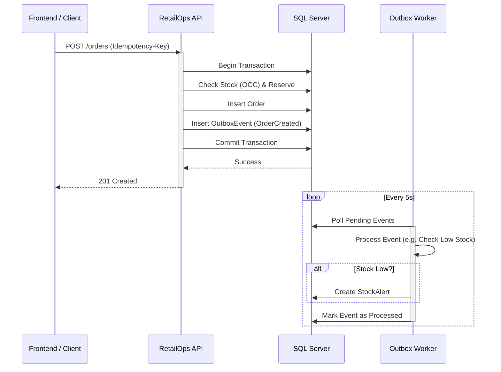

# RetailOps Hub 🚀

Sistema de gestión de operaciones retail "Enterprise-grade" construido con **.NET 9 (Clean Architecture)** y **Angular 19 (Tailwind CSS v4)**. Diseñado para demostrar patrones avanzados de confiabilidad y arquitectura de software moderna.


## 🏗️ Arquitectura & Patrones

Este proyecto no es un CRUD simple. Implementa patrones de diseño para resolver problemas reales de sistemas distribuidos y alta concurrencia.

### 1. Monolito Modular (Clean Architecture)
El código está estructurado en capas estrictas para mantener la independencia del dominio:
- **Domain:** Entidades puras y reglas de negocio (`Inventory`, `Order`, `StockAlert`).
- **Application:** Casos de uso (`OrderService`), DTOs e Interfaces.
- **Infrastructure:** Implementación de persistencia (EF Core), Background Jobs y adaptadores externos.
- **Api:** Controladores REST, Middleware y Configuración.

### 2. Confiabilidad & Consistencia (The "Reliability" Core)
- **Transactional Outbox:** Garantiza que *nunca* se pierda un evento de integración (`OrderCreated`, `StockLow`). Los eventos se guardan en la misma transacción SQL que los datos de negocio y un `BackgroundWorker` los procesa asíncronamente.
- **Optimistic Concurrency Control (OCC):** Uso de `RowVersion` (SQL Server TIMESTAMP) para prevenir condiciones de carrera (Race Conditions) y sobre-venta de inventario cuando múltiples usuarios compran el mismo SKU simultáneamente.
- **Idempotencia:** Middleware personalizado que intercepta peticiones `POST` basándose en un header `Idempotency-Key` y un hash del cuerpo del request. Si el cliente reintenta una operación por fallo de red, el sistema devuelve la respuesta original sin re-procesar la orden.

### 3. Observabilidad & Auditoría
- **Auditoría Automática:** Un `SaveChangesInterceptor` de EF Core captura *cada* cambio (`Added`, `Modified`, `Deleted`) y guarda un snapshot JSON del "antes y después" en la tabla `AuditLogs`.
- **Health Checks:** Monitoreo activo de la conectividad con la base de datos.
- **Correlation ID:** Trazabilidad distribuida mediante `X-Correlation-ID` propagado en todos los logs y respuestas.

### 4. Frontend Moderno
- **Angular 19 + Tailwind CSS v4:** Interfaz reactiva usando Signals, componentes Standalone y diseño "Utility-first".
- **Real-time UX:** Feedback inmediato, gestión de estados de carga y manejo de errores amigable.

## 🔄 Diagrama de Flujo (Core Order)



## 🚀 Quick Start (Docker)

La forma más rápida de levantar el entorno completo (Base de Datos + API + Frontend).

1.  **Clonar el repositorio:**
    ```bash
    git clone https://github.com/tu-usuario/retailops-hub.git
    cd retailops-hub
    ```

2.  **Levantar el stack:**
    ```bash
    docker compose up --build
    ```

3.  **Acceder:**
    *   **Frontend:** [http://localhost:4200](http://localhost:4200)
    *   **Backend API:** [http://localhost:5000/swagger](http://localhost:5000/swagger)
    *   **SQL Server:** `localhost:1433` (User: `sa`, Pass: `RetailOps@2025!`)

## 💻 Desarrollo Local (Manual)

### Prerrequisitos
*   .NET SDK 9.0
*   Node.js 20+
*   SQL Server (LocalDB o Docker)

### 1. Backend
```powershell
cd backend
# Configura tu conexión en appsettings.json si no usas la default
dotnet ef database update --project RetailOps.Infrastructure --startup-project RetailOps.Api
dotnet run --project RetailOps.Api
```

### 2. Frontend
```bash
cd frontend
npm install
npm start
```

## 🧪 Testing

El proyecto incluye una suite de pruebas de integración que valida el ciclo de vida de las órdenes y la consistencia del inventario usando SQLite In-Memory.

```bash
dotnet test backend/RetailOps.Tests
```

## 🎬 Demo Script (5 Minutos)

Sigue estos pasos para demostrar las capacidades del sistema:

### 1. Dashboard & Multi-Tienda (30s)
1.  Abre el Frontend (`http://localhost:4200`).
2.  Observa los KPIs y la tabla de **Stock Crítico**.
3.  Cambia la tienda en el selector superior (de "Tienda Central" a "Sucursal Norte").
4.  Observa cómo los datos se actualizan instantáneamente (Signal/Effect).

### 2. Ciclo de Venta & Concurrencia (2 min)
1.  Ve a la pantalla **Ventas**.
2.  Selecciona items del inventario (ej. "Smartphone X1").
3.  Haz clic en **Confirmar Orden**.
    *   *Backend:* Se crea la orden, se reserva stock y se emite evento `OrderCreated`.
4.  Ve a **Listado** y observa la nueva orden en estado `Reserved`.
5.  (Opcional) Intenta comprar más stock del disponible de otro producto para ver el error `409 Conflict`.

### 3. Gestión de Alertas (1 min)
1.  Si compraste un producto con stock bajo, ve a **Alertas**.
2.  Verás una nueva alerta "Critical Stock" generada asíncronamente por el Worker.
3.  Haz clic en **Atender** (Ack) y luego en **Resolver**.

### 4. Auditoría & Trazabilidad (1.5 min)
1.  Ve a **Auditoría**.
2.  Muestra el registro detallado de la creación de la orden.
3.  Expande el JSON para ver el "Antes" y "Después" del inventario.
4.  Ve a **Outbox** para confirmar que el evento de integración fue procesado correctamente.

## 📂 Estructura del Proyecto

```
retailops-hub/
├── backend/                 # .NET 9 Solution
│   ├── RetailOps.Api/       # Entry point, Controllers
│   ├── RetailOps.Application/ # Business Logic (Services)
│   ├── RetailOps.Domain/    # Entities (Rich Domain Model)
│   ├── RetailOps.Infrastructure/ # EF Core, Migrations, Workers
│   └── RetailOps.Tests/     # Integration Tests
├── frontend/                # Angular 19 Standalone
│   ├── src/app/features/    # Feature Modules (Dashboard, Orders...)
│   └── src/app/shared/      # Shared Components
└── docker-compose.yml       # Orchestration
```

---
**Autor:** [Tu Nombre]
*Construido como demostración de capacidades Fullstack Senior.*